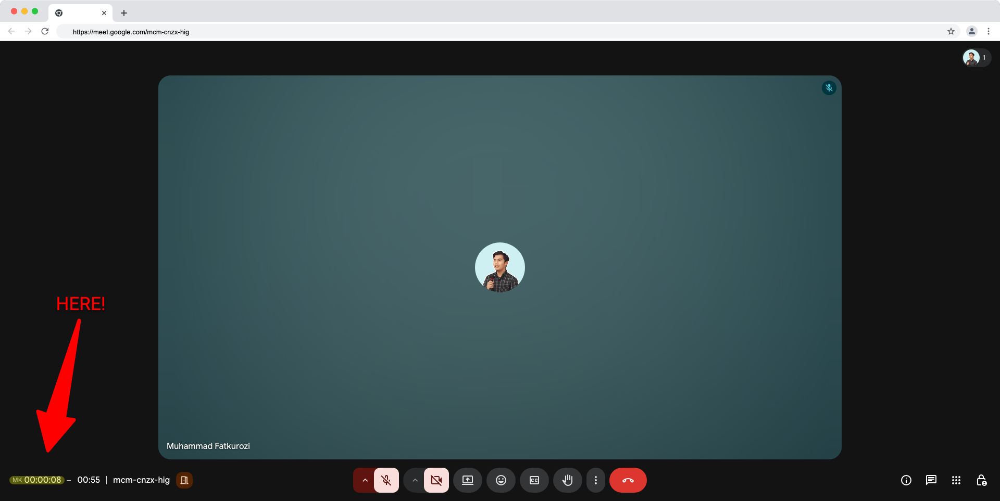

# MeetKeep

Automatically injects a meeting timer into Google Meet.

<details>
<summary>Screenshot</summary>



</details>

## Install

1. Download the latest release from [GitHub Releases](https://github.com/ibnumardini/meetkeep/releases)
2. Extract the zip
3. Open Chrome → `chrome://extensions`
4. Enable **Developer mode**
5. Click **Load unpacked** → select the extracted folder

## Development

```bash
pnpm install       # install dependencies
pnpm build         # build to build/
pnpm watch         # build + watch for changes
pnpm zip           # build + package to dist/
```

## Author

Muhammad Fatkurozi · [hi@mardini.dev](mailto:hi@mardini.dev)

## License

Apache-2.0
